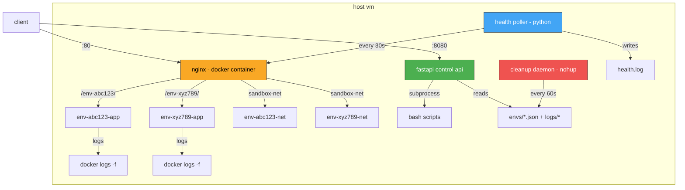

# devops sandbox platform

a self-service platform where you spin up isolated temporary environments, deploy apps into them, simulate outages, monitor health, and destroy everything — automatically or on demand. think of it as a mini internal heroku with a chaos engineering toggle. every environment is short-lived by design.

## architecture



### network design

- **sandbox-net**: main docker bridge network that nginx sits on
- **env-$id-net**: per-environment bridge network for isolation. nginx dynamically connects to each one on create and disconnects on destroy
- docker's embedded dns at `127.0.0.11` resolves container names within networks, so nginx can proxy to `env-abc123-app:8080` without hardcoded ips

### log shipping (approach a)

each env's container logs are tailed via `docker logs -f` and written to `logs/$env_id/app.log`. the background process pid is stored in the state file and killed on destroy — no zombie processes. it's the simple approach but it works. `make logs ENV=env-abc123` tails the log for you.

## prerequisites

- ubuntu 22.04 lts (or similar linux)
- docker 20.x+ and docker compose v2
- python 3.10+ with pip
- make, jq, curl
- rust toolchain (only if you want to build the demo app locally — the docker build handles it for you)

## quick start

from zero to first running env in under 5 commands:

```bash
# 1. clone the repo
git clone https://github.com/DavidIfebueme/devops-sandbox.git
cd devops-sandbox

# 2. set your config
cp .env.example .env
# edit .env — set HOST_IP to your server's public ip

# 3. build the sandbox app image
make build-app

# 4. start the platform
make up

# 5. create your first environment
make create
# follow the prompts — you'll get a url back
```

that's it. visit the url and you'll see your running environment.

## api endpoints

the control api wraps all the bash scripts. 6 endpoints, all REST:

| method | endpoint            | what it does                        |
|--------|---------------------|-------------------------------------|
| post   | `/envs`             | create a new environment            |
| get    | `/envs`             | list all active envs + ttl remaining|
| delete | `/envs/:id`         | destroy an environment              |
| get    | `/envs/:id/logs`    | last 100 lines of app.log           |
| get    | `/envs/:id/health`  | last 10 health check results        |
| post   | `/envs/:id/outage`  | trigger outage simulation           |

full interactive docs at `http://<host>:8080/docs` (swagger ui)

## demo walkthrough

here's the full flow — create → deploy → check health → simulate outage → observe → recover → auto-destroy:

```bash
# start the platform
make up

# create an environment named "demo" with 60-minute ttl
bash platform/create_env.sh demo 60
# note the env_id and url from the output

# check the environment is healthy
make health

# hit the environment directly
curl http://<host>/env-XXXXXX/

# simulate a crash
make simulate ENV=env-XXXXXX MODE=crash

# wait up to 90 seconds — health monitor will detect the failure
make health
# status should show "degraded"

# recover the environment
make simulate ENV=env-XXXXXX MODE=recover

# verify recovery
make health

# check logs
make logs ENV=env-XXXXXX

# destroy the environment
make destroy ENV=env-XXXXXX

# or just wait — the cleanup daemon will auto-destroy when ttl expires
```

## make targets

run `make help` to see all available targets.

| target                | what it does                                       |
|-----------------------|----------------------------------------------------|
| `make up`             | start nginx + daemon + api + health poller         |
| `make down`           | stop everything, destroy all environments          |
| `make create`         | create a new environment (prompts for name + ttl)  |
| `make destroy ENV=`   | destroy a specific environment                     |
| `make logs ENV=`      | tail environment logs                              |
| `make health`         | show health status of all environments             |
| `make simulate ENV= MODE=` | run outage simulation                        |
| `make clean`          | wipe all state, logs, archives                     |
| `make build-app`      | build the sandbox app docker image                 |
| `make monitoring`     | start prometheus + grafana (optional)              |

## outage simulation modes

| mode      | what happens                                             |
|-----------|----------------------------------------------------------|
| `crash`   | kills the container — health monitor catches it within 90s|
| `pause`   | pauses the container — recover with unpause               |
| `network` | disconnects the container from its docker network         |
| `recover` | restores whatever was broken (restart, unpause, reconnect)|
| `stress`  | spikes cpu with stress-ng (optional)                      |

**safety guard:** the simulation script flat out refuses to target nginx, daemon, api, prometheus, or grafana containers. you can't accidentally take down the platform itself.

## known limitations

1. no auth — this is an internal tool, not exposed to the internet (hopefully)
2. log shipping via `docker logs -f` is simple but won't cut it for high-throughput production use
3. state lives in flat json files — no concurrency guarantees if two api calls hit at the exact same time
4. the health poller checks through nginx, so if nginx is down everything looks unhealthy
5. environment names aren't unique — only env ids are
6. no resource limits on containers — a misbehaving app can eat all your ram
7. the cleanup daemon is a bash loop, not a systemd service — it works but it's not production-grade
8. stress-ng might not be available inside the sandbox app container by default
