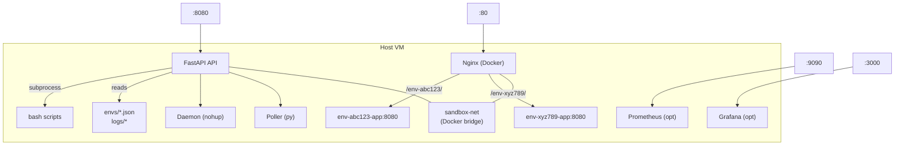

# DevOps Sandbox Platform

A self-service platform for spinning up isolated temporary environments, deploying apps, simulating outages, monitoring health, and tearing everything down — automatically or on demand.

## Architecture



### Network Design

- **sandbox-net**: Docker bridge network connecting Nginx to platform services
- **env-$ID-net**: Per-environment bridge network providing isolation
- Nginx dynamically connects to each env network on create, disconnects on destroy
- Docker's embedded DNS (127.0.0.11) resolves container names within networks

### Log Shipping (Approach A)

Each environment's container logs are tailed via `docker logs -f` and written to `logs/$ENV_ID/app.log`. The background process PID is stored in the state file and killed on destroy to prevent zombies.

## Prerequisites

- Ubuntu 22.04 LTS (or similar Linux)
- Docker 20.x+ and Docker Compose v2
- Python 3.10+ with pip
- make, jq, curl

## Quick Start

```bash
# 1. Clone the repo
git clone https://github.com/<YOUR_ORG>/devops-sandbox.git
cd devops-sandbox

# 2. Configure environment
cp .env.example .env
# Edit .env and set HOST_IP to your server's public IP

# 3. Build the sandbox app image
make build-app

# 4. Start the platform
make up

# 5. Create your first environment
make create
# Follow the prompts — you'll get a URL back

# That's it! Visit the URL to see your running environment.
```

## API Endpoints

| Method | Endpoint            | Description                     |
|--------|---------------------|---------------------------------|
| POST   | `/envs`             | Create a new environment        |
| GET    | `/envs`             | List all active environments    |
| DELETE | `/envs/:id`         | Destroy an environment          |
| GET    | `/envs/:id/logs`    | Last 100 lines of app.log       |
| GET    | `/envs/:id/health`  | Last 10 health check results    |
| POST   | `/envs/:id/outage`  | Trigger outage simulation       |

API docs available at `http://<HOST>:8080/docs` (Swagger UI)

## Demo Walkthrough

```bash
# Start the platform
make up

# Create an environment named "demo" with 60-minute TTL
bash platform/create_env.sh demo 60
# Note the ENV_ID and URL from the output

# Check the environment is healthy
make health

# Hit the environment directly
curl http://<HOST>/env-XXXXXX/

# Simulate a crash
make simulate ENV=env-XXXXXX MODE=crash

# Wait up to 90 seconds — health monitor will detect failure
make health
# Status should show "degraded"

# Recover the environment
make simulate ENV=env-XXXXXX MODE=recover

# Verify recovery
make health

# Check logs
make logs ENV=env-XXXXXX

# Destroy the environment
make destroy ENV=env-XXXXXX

# Or just wait — the cleanup daemon will auto-destroy when TTL expires
```

## Make Targets

Run `make help` to see all available targets.

| Target              | Description                                    |
|---------------------|------------------------------------------------|
| `make up`           | Start Nginx + daemon + API + health poller     |
| `make down`         | Stop everything, destroy all environments      |
| `make create`       | Create a new environment (interactive)          |
| `make destroy ENV=` | Destroy specific environment                   |
| `make logs ENV=`    | Tail environment logs                          |
| `make health`       | Show health status of all environments         |
| `make simulate ENV= MODE=` | Run outage simulation                  |
| `make clean`        | Wipe all state, logs, archives                 |
| `make build-app`    | Build the sandbox app Docker image             |
| `make monitoring`   | Start Prometheus + Grafana (optional)          |

## Outage Simulation Modes

| Mode      | Effect                                         |
|-----------|------------------------------------------------|
| `crash`   | Kills the container (health monitor catches it) |
| `pause`   | Pauses the container (recover with unpause)     |
| `network` | Disconnects container from its network          |
| `recover` | Restores whatever was broken                    |
| `stress`  | Spikes CPU with stress-ng (optional)           |

**Safety guard:** The simulation script refuses to target Nginx, daemon, API, Prometheus, or Grafana containers.

## Known Limitations

1. No authentication or authorization — this is an internal tool
2. Log shipping via `docker logs -f` is simple but not suitable for high-throughput production use
3. State is stored in flat JSON files — no concurrency guarantees for simultaneous API writes
4. The health poller checks through Nginx, so if Nginx is down, all envs appear unhealthy
5. Environment names are not unique — only ENV_IDs are unique
6. No resource limits on containers — a misbehaving app can consume all host resources
7. The cleanup daemon runs as a simple bash loop — not a proper systemd service
8. stress-ng may not be available inside the sandbox app container by default
